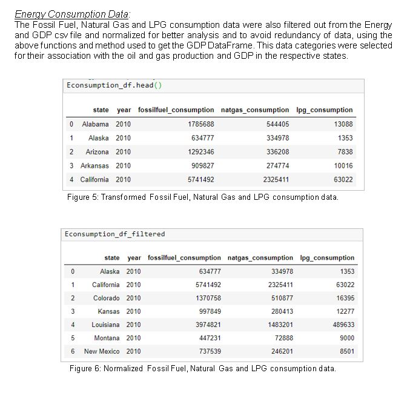

# ETL PROJECT REPORT

Jupiter notebook and sql schema and queries are in the folder 'Oil and Gas'

ETL steps in Jupyter notebook- data_etl.ipynb

ERD of table - ERD.png

SQL schema- oil&gas_schema.sql

Table joins  - queries.sql

Final report  - Final Report ETL.docx
